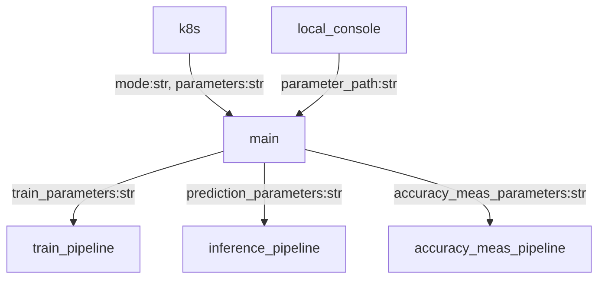
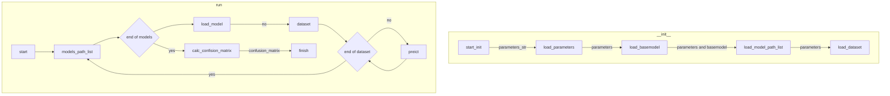

# What it is?

## AWS CLI

```shell
aws  --endpoint-url http://192.168.1.194:9000 s3 ls s3://config/train
```


## Design

### Workflow



### Main

This is an endpoint of whole program

- Tasks:
    - Load parameters and type of tasks as a form of string.
    - Convert parameters into an instance of parameters dataclass of each tasks.
    - Start up the tasks with giving the instance of parameters dataclass.


### InferencePipeline

This part implements a pipeline process of inference.

- Args:
    - An instance of parameters dataclass of inference pipeline.
- Tasks:
    - Initialization:
        - Initialize the instance with a given parameters.
        - Initialize the data transfer instance of cloud storage.
        - Load inference model from storage.
    - Run:
        - Run prediction with the loaded model.


### AccuracyMeasurementPipeline

This part implements a pipeline process of accuracy measurement of models trained with `TrainPipeline`.

There could be a series of models that are trained with `TrainPipeline`, but which is the best model is not yet fixed. 
This process evaluates each model using a test dataset and a series of models.




